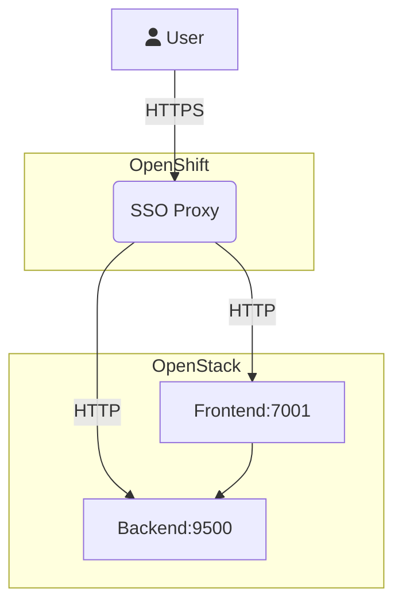

# Run Registry

## What is Run Registry?

The process of monitoring and certifying data in the CMS experiment consists of several stages. Each through which new decision-making information regarding the quality of data is revealed. Run Registry is an application designed to document and aggregate each decision made -and by which actor, either human, automatic or machine learning agent- at every stage. It is then responsible for aggregating and exposing the results of data deemed good or ‘usable for analysis’ to the CMS collaboration in what is known as the **golden** json.

## What is the _stack_?

From a technical standpoint, run registry is a full-stack javascript application. With a frontend built with React and a backend built with Node.js, it uses a PostgreSQL database instance running in **CERN DB on demand** and a redis microservice to handle the job queue for backend processing.

## What is contained in this repository?

- ### [Run Registry Frontend](https://github.com/cms-DQM/runregistry/blob/master/runregistry_frontend/readme.md)

  The frontend of run registry is written in JavaScript using React.js and Next.js. You can read more about it [here](https://github.com/cms-DQM/runregistry/blob/master/runregistry_frontend/readme.md).

- ### [Run Registry Backend](https://github.com/cms-DQM/runregistry/blob/master/runregistry_backend/readme.md)

  The backend of run registry is written in JavaScript using Node.js. You can read more about it [here](https://github.com/cms-DQM/runregistry/blob/master/runregistry_backend/readme.md).

- ### [The Python API Client](https://github.com/cms-DQM/runregistry/tree/master/runregistry_api_client)

  The API client is a Python PIP package that interfaces via HTTP requests with the API of run registry and allows users to read data easily from the application. You can read more about it [here](https://github.com/cms-DQM/runregistry/tree/master/runregistry_api_client).

- ### The Github Action definitions
  They are in charge of building and pushing the frontend and microservices into Dockerhub on every push to the master branch. They are located in the .github folder.

This repository contains all the code from Run Registry. However, it doesn't contain the commit log of how the application was developed. To view them go to the individiual repositories (which are no longer used) of every component mentioned above. To modify the application you must do so however in this repository only.

# Architecture

## Microservices

Run registry is designed using loosely-coupled microservices. This architecture allows for future maintainers to only need to know how a given microservice works either to maintain it or replace it.

Run registry encompasses 5 microservices, each with its respective Dockerfile and dockerhub repository, here is a list of them with its respective dockerhub repository:

1. The API. cmssw/runregistry-backend
2. The service in charge of fetching runs & lumsiections from the OMS API. cmssw/runregistry-workers-oms-fetching
3. The service in charge of pinging the DQM GUI API. cmssw/runregistry-workers-dqm-gui-pinging
4. The service in charge of processing the jsons. cmssw/runregistry-workers-json-processing
5. A helper redis service which serves as a transport queue between service 1 and 4.

<!-- The following will expand on every service.

1. The API.

Run Registry's API is the most complex microservice, it contains all the routes, the ORM definition models and controllers of the application. -->

## Event Sourcing

There are two ways that Run Registry uses Event Sourcing: for configuration, and for data.

- For configuration

Run registry has multiple sources of configuration, some of them can be changed on the fly via the web interface, other configurations need to be changed via a change in the database, and the least commonly modified configurations need to be changed in code in one of the config.js files. Configurations updated via web interface are all event-sourced: The dataset classifier, class classifier, component classifier, datasets accepted in GUI classifier (datasets accepted), JSON classifier, offline dataset classifier. This means that all versions are tracked in the database, when a classifier is deleted it is not really deleted forever, there is a copy of it still hanging in the database. When it is edited, the previous version is also saved.

- For data

There is a great amount of effort in making Run Registry event-sourced on a run and per-lumisection basis.
If there is a human error, for example if a user sometimes batch-updates runs and sets wrong values, there will always be a way to undo it. And there will be a track of what was done, by whom and when.

## Deployment

Both the production and development instances are deployed on [Openstack](https://openstack.cern.ch/). You should have been given access to the projects automatically by the DQM-DC egroups.
To handle authentication/authorization, a proxy is deployed on [PaaS/OpenShift](https://paas.cern.ch/), one for each instance. The proxy is running custom code found [here](https://github.com/cms-DQM/cern-oauth2-sso-node-proxy). To access the proxies' deployment, you will need to login to PaaS with the `cmsdqm` service account.

TODO: This proxy uses the old CERN SSO with ADFS, to be deprecated in Summer 2023.



## How to update the Run Registry instances?

### [Run Registry development](https://dev-cmsrunregistry.web.cern.ch/):

From your computer:

```bash
 ssh -tCY username@lxplus.cern.ch ssh  -CY username@dev-runregistry.cern.ch
```

On `dev-runregistry.cern.ch`:

```bash
 cd /srv/node && export HOME=$PWD
 export PATH=/srv/node/bin/:$PATH
 cd /srv/
 export NODE_ENV=production
 export ENV=staging
 export CLIENT_SECRET= #Ask DQM core conveners
 sudo chmod -R 777 /srv/
 forever stopall
 rm -rf node
 sudo wget https://nodejs.org/dist/v12.20.0/node-v12.20.0-linux-x64.tar.xz
 sudo tar -xf node-v12.20.0-linux-x64.tar.xz
 sudo mv node-v12.20.0-linux-x64 node
 sudo rm node-v12.20.0-linux-x64.tar.xz
 sudo chmod -R 777 /srv/
 cd node && export HOME=$PWD
 cd ..
 export PATH=/srv/node/bin/:$PATH
 npm install forever -g
 npm i yarn -g
 rm -rf runregistry
 git clone https://github.com/cms-DQM/runregistry
 cd runregistry/runregistry_frontend
 sudo chmod -R 777 /srv/
 mkdir certs
 yarn
 sudo chmod -R 777 /srv/
 yarn build
 sudo chmod -R 777 /srv/
 forever start server.js
 cd ../runregistry_backend
 ## how to generate key and certificate, check the section below
 <!--
 cp your cert usercert.pem certs/usercert.pem
 cp cp your key certs/userkey.pem
 -->
 yarn
 forever start app.js
```

After starting the project, it's important to check logs, is everything working fine!
Logs can be found by running a command: `forever logs`

## [Run Registry production](https://cmsrunregistry.web.cern.ch/)

On your computer:

```bash
 ssh -tCY username@lxplus.cern.ch ssh  -CY username@runregistry.cern.ch
```

On `runregistry.cern.ch`:

```bash
 cd /srv/node && export HOME=$PWD
 export PATH=/srv/node/bin/:$PATH
 cd /srv/
 export NODE_ENV=production
 export ENV=production
 export CLIENT_SECRET= #Ask DQM core conveners
 sudo chmod -R 777 /srv/
 forever stopall
 rm -rf node
 sudo wget https://nodejs.org/dist/v12.20.0/node-v12.20.0-linux-x64.tar.xz
 sudo tar -xf node-v12.20.0-linux-x64.tar.xz
 sudo mv node-v12.20.0-linux-x64 node
 sudo rm node-v12.20.0-linux-x64.tar.xz
 sudo chmod -R 777 /srv/
 cd node && export HOME=$PWD
 cd ..
 export PATH=/srv/node/bin/:$PATH
 npm install forever -g
 npm i yarn -g
 rm -rf runregistry
 git clone https://github.com/cms-DQM/runregistry
 cd runregistry/runregistry_frontend
 sudo chmod -R 777 /srv/
 yarn
 sudo chmod -R 777 /srv/
 yarn build
 sudo chmod -R 777 /srv/
 forever start server.js
 cd ../runregistry_backend
 yarn
 mkdir certs
 ## how to generate key and certificate, check the section below
 <!--
 cp your cert usercert.pem certs/usercert.pem
 cp cp your key certs/userkey.pem
 -->
 forever start app.js
```

After starting the project, it's important to check logs, is everything working fine!
Logs can be found by running a command: `forever logs`

## How to generate key and certificate?

You need to have grid certificate, provoded by CERN, https://ca.cern.ch/ca/

After, execute following commands:
Geberate a private key:

```bash
openssl pkcs12 -in myCertificate.p12 -nokeys -out usercert.pem -nodes
```

Geberate a certificate:

```bash
openssl pkcs12 -in myCertificate.p12 -nocerts -out userkey.pem -nodes
```

## Are you Run Registry developer, but cannot connect to RR VMs?

The person, who has sudo rights to dev-runregistry and runregistry machines has to add you as a user:

```bash
sudo useraddcern username
```

To give sudo rights (optional):

```bash
sudo usermod -aG wheel username
```

Check, can you connect to the machine(-s):

```bash
ssh -tCY username@lxplus.cern.ch ssh  -CY username@dev-runregistry.cern.ch
```

```bash
ssh -tCY username@lxplus.cern.ch ssh  -CY username@runregistry.cern.ch
```

Check do you have sudo rights (optional):

```bash
sudo whoami
```

## FAQ

### Main workflows

#### Update runs

Entry point - get some runs from OMS:
https://github.com/cms-DQM/runregistry/blob/e941fe70a419629796dfeed9803b26dc8ee9dc25/runregistry_backend/cron/1.get_runs.js#L28

Somehow calculate how many we would like to update and update:
https://github.com/cms-DQM/runregistry/blob/e941fe70a419629796dfeed9803b26dc8ee9dc25/runregistry_backend/cron/1.get_runs.js#L89

Update OMS atributes and bits per lumisection:
https://github.com/cms-DQM/runregistry/blob/e941fe70a419629796dfeed9803b26dc8ee9dc25/runregistry_backend/cron/2.save_or_update_runs.js#L142-L143

Update RR attributes and bits per lumisection:
https://github.com/cms-DQM/runregistry/blob/e941fe70a419629796dfeed9803b26dc8ee9dc25/runregistry_backend/cron/2.save_or_update_runs.js#L150

Put the all OMS & RR info to the our server using link:
https://github.com/cms-DQM/runregistry/blob/e941fe70a419629796dfeed9803b26dc8ee9dc25/runregistry_backend/cron/2.save_or_update_runs.js#L164

Actually function is:
https://github.com/cms-DQM/runregistry/blob/3169ae5b2cf923218d2f845839c6d5c2aef260fe/runregistry_backend/controllers/run.js#L257

#### Frontend

It is based on React.

### Some operations tasks

#### Connect to DB

Via `psql`:

```bash
psql -h dbod-gc005.cern.ch -p 6601 -U username
```

using password & username obtained from DQM core.

You can also use `pgadmin4` for convenience.

#### Delete a run from the DB

```sql
DO $$
DECLARE
	run_number_to_delete integer := 382656;
BEGIN
	EXECUTE 'SELECT * FROM public."Run" WHERE run_number = $1' USING run_number_to_delete;
	EXECUTE 'DELETE FROM public."DatasetEvent" WHERE run_number = $1' USING run_number_to_delete;
	EXECUTE 'DELETE FROM public."DatasetTripletCache" WHERE run_number = $1' USING run_number_to_delete;
	EXECUTE 'DELETE FROM public."LumisectionEvent" WHERE run_number = $1' USING run_number_to_delete;
	EXECUTE 'DELETE FROM public."OMSLumisectionEvent" WHERE run_number = $1' USING run_number_to_delete;
	EXECUTE 'DELETE FROM public."Dataset" WHERE run_number = $1' USING run_number_to_delete;
	EXECUTE 'DELETE FROM public."Run" WHERE run_number = $1' USING run_number_to_delete;
 	EXECUTE 'DELETE FROM public."RunEvent" WHERE run_number = $1' USING run_number_to_delete;
END $$;
```

#### Add e-group into DB

```sql
INSERT INTO public."Permission" VALUES (40, 'cms-dqm-runregistry-offline-gem-certifiers', '["/datasets/gem/move_dataset/OPEN/SIGNOFF", "/datasets/gem/move_dataset/OPEN/COMPLETED", "/datasets/gem/move_dataset/SIGNOFF/COMPLETED", "/datasets/gem/move_dataset/COMPLETED/SIGNOFF", "/dataset_lumisections/gem.*", "/cycles/move_dataset/gem/.*", "/json_portal/generate"]', NOW());
INSERT INTO public."PermissionEntries" VALUES (40, 1);
```

#### Add new Offline classifier

For example, to add a new one with `id = 36`:

```sql
INSERT INTO public."OfflineDatasetClassifier" VALUES (36, '{"if": [{"and": [{"in": ["Prompt", {"var": "name"}]}]}, true, false]}', 'gem', true, NOW(), 'pmandrik', 'pmandrik@cern.ch' );
```

`OfflineDatasetClassifierList` - list of versions, add new version:

```sql
INSERT INTO public."OfflineDatasetClassifierList" VALUES (20);
```

`OfflineDatasetClassifierEntries`: entries associated with version, add entries from `OfflineDatasetClassifier` into new version we created above:

```sql
INSERT INTO public."OfflineDatasetClassifierEntries" VALUES (2, 20), (3, 20), (4, 20), (6, 20), (7, 20), (8, 20), (9, 20), (10, 20), (11, 20), (12, 20), (13, 20), (14, 20), (15, 20), (16, 20), (18, 20), (34, 20), (35, 20), (36, 20);
```

#### Change DB password

Follow:
https://dbod-user-guide.web.cern.ch/getting_started/PostgreSQL/postgresql/#setting-or-changing-the-password

#### User authorization

https://auth.docs.cern.ch/user-documentation/faqs/

#### Add logic to GEM RR attributes

```json
{"and": [{"var": "gem_included"}, {"or": [{"==": [{"var": "gemp_ready"}, false]}, {"==": [{"var": "gemm_ready"}, false]}]}]}
{"and": [{"var": "gem_included"}, {"and": [{"==": [{"var": "gemp_ready"}, true]}, {"==": [{"var": "gemm_ready"}, true]}]}]}
```

#### Creating docker images and deploying on Openshift

Each `package.json` contains shorthand commands for building and pushing docker images to registry.cern.ch, as well as redeploying them on Openshift.

Check the Wiki for more information.

#### Redis server

REDIS server is used by BULL JS package to store configs used to generate JSONs in a queue

```bash
sudo yum install redis
sudo nano /etc/redis.conf
supervised no -> supervised systemd
sudo systemctl restart redis.service
```

Check that it's running:

```bash
redis-cli
ping
```

Set `REDIS_HOST`, `REDIS_PORT` and `REDIS_PASSWORD` to match your redis server (Usually `127.0.0.1`, `6379` and no password).

#### Upload LS from brilcalc

Split brilcalc csv to store information per run

```bash
awk -F', ' '{ date = substr($1,0,6) } !(date in outfile) { outfile[date] = date".csv" } { print > (outfile[date]) }' 2022_lumi_355100_357900.csv
```

In the `runregistry` VM, put files into `/srv/runregistry/runregistry_backend/uploader/luminosity`. Execute the updater:

```bash
cd /srv
source setup_prod.sh
cd /srv/runregistry/runregistry_backend/uploader/
node upload_lumisection_luminosity_brilcalc.js
```

#### Antd style fix

Frontend uses the `antd` js library for some GUI stuff, e.g. dropboxes & breadcrumbs. The style of the original library is overwritten in `public/static/ant-modified.min.css`.

For example in the commit https://github.com/cms-DQM/runregistry/commit/431550037f28e7953b68db7955faa4caedf20c76
we remove the new lines and enumeration from ordered list as it is expected to be done in antd style we overwrite..

#### How are specific actions mapped to specific e-groups?

In the `Permissions` table, each e-group is given access to specific `routes`.
